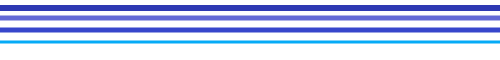

<table align="center" border="0" cellpadding="0" cellspacing="0">
  <tr>
    <td width="10%"></td>
    <td width="80%"></td>
    <td width="10%"></td>
  </tr>
  <tr>
    <td></td>
    <td align="center">
        

          
        

	<h2 align="center">Hello, my name is Donnie.</h2> 
      	
I’m an aspiring developer from Berlin, Germany, with a background in education. My current focus is <b><i>web and application development</i></b>, where I am continually expanding my skills.
  
	
I enjoy getting to know new technologies and experimenting with creative solutions. In addition to coding, I enjoy gaming and streaming, where I connect with people and share my passion for interactive entertainment.
   
	             
	
    </td>
    <td></td>
  </tr>
  <tr>
    <td></td>
    <td></td>
    <td></td>
  </tr>
</table>
